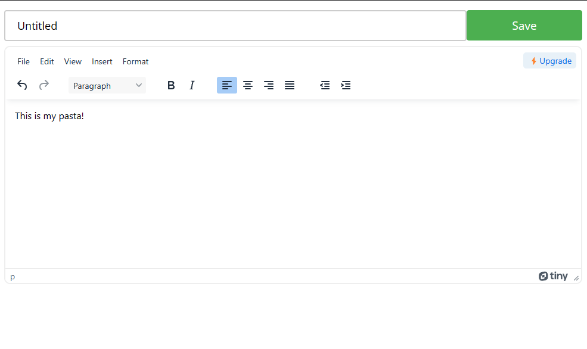

# PastaBin

Tools:
- Blazor Server on .NET 7
- MongoDB & supporting NuGet packages
- TinyMCE (self-hosted)
- ChatGPT (css styling for input and buttons)

A pastebin like app using Blazor Server and MongoDB I put together in a few hours.

Update the MongoDB connection string and run ```run.ps1``` on Windows.

When you save a pasta, you can grab the url for reference (baseUrl/guid).

